# PSOC&trade; 4 Safety test library training manual

## About this document

This is the lab manual for the PSOC&trade; 4 safety test library (mtb-stl) training.

## Scope and purpose

In these labs, you will learn the following:

- Add the mtb-stl middleware to your project
- Execute the core peripherals safety tests
- Execute the analog peripherals safety tests
- Execute the communication block safety tests

## Intended audience

This manual is intended for design engineers, technicians, and developers of electronic systems.

### Table of contents

- [About this document](#about-this-document)
- [Scope and purpose](#scope-and-purpose)
- [Intended audience](#intended-audience)
- [Table of contents](#table-of-contents)
- [Introduction](#introduction)
- [Required development tools and prerequisites](#required-development-tools-and-prerequisites)
- [Adding mtb-stl to an existing project](#adding-mtb-stl-to-an-existing-project)
- [Executing the core peripherals safety tests](#executing-the-core-peripherals-safety-tests)
- [Executing the analog peripherals safety tests](#executing-the-analog-peripherals-safety-tests)
- [Executing the communication block safety test](#executing-the-communication-block-safety-test)
- [References](#references)
- [Revision history](#revision-history)
- [Disclaimer](#disclaimer)

## Introduction

This manual provides instructions to add the mtb-stl middleware to an existing project. It also provides instructions for creating code examples to execute the core peripherals safety test, analog peripherals safety tests, and communication block safety test.

## Required development tools and prerequisites

### Tools

- [ModusToolbox&trade;](https://softwaretools.infineon.com/tools/com.ifx.tb.tool.modustoolboxsetup) software v3.6 or later (tested with v3.6)
- ModusToolbox&trade; CAPSENSE&trade; and Multi-Sense Pack
- A [MiniProg4 (CY8CKIT-005-A)](https://www.infineon.com/evaluation-board/CY8CKIT-005-A) programmer/debugger
- Jumper wires (4 qty)
- 150 kΩ and 75 kΩ through-hole resistors
- A breadboard
- PSOC&trade; 4100T Plus Prototyping Kit - [CY8CPROTO-041TP](https://www.infineon.com/evaluation-board/CY8CPROTO-041TP)

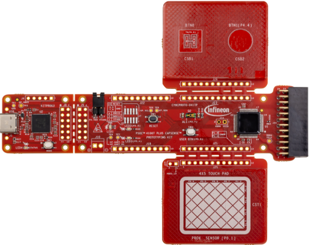

### Prerequisites

- [PSOC&trade; digital peripherals training](https://github.com/Infineon/mtb-training-psoc-digital-peripherals)
- [ModusToolbox&trade;](https://softwaretools.infineon.com/tools/com.ifx.tb.tool.modustoolboxsetup) software v3.6
- Eclipse IDE for ModusToolbox&trade;

## Adding mtb-stl to an existing project

### Objective

In this lab, you will create the hello world example project and then add the mtb-stl middleware to the project using the library manager. Once the mtb-stl middleware is added, you will add the program counter safety test to the application and then build and run the program.

### Project creation

1. Before creating the first project in this training series, you need to create a workspace in ModusToolbox&trade;. Open **ModusToolbox&trade;** from the **Windows Start** menu.

    > **Note:** If you have not installed ModusToolbox&trade;, see the [Tools](#tools) section. If you have already created a workspace, skip this step and go to [step 4](#step-4-project-creation).

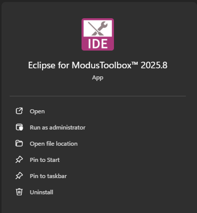

2. Choose a **workspace directory** for your project. After selecting a suitable directory, click **Launch**.

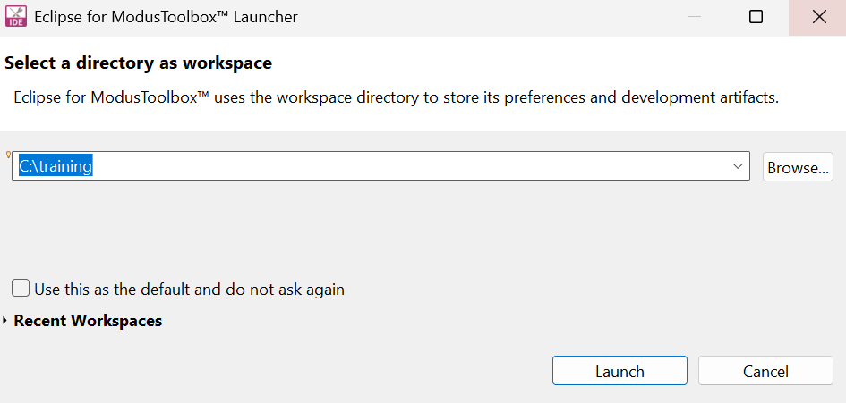

3. Click **Launch**, and a new ModusToolbox&trade; workspace will open, as shown below.

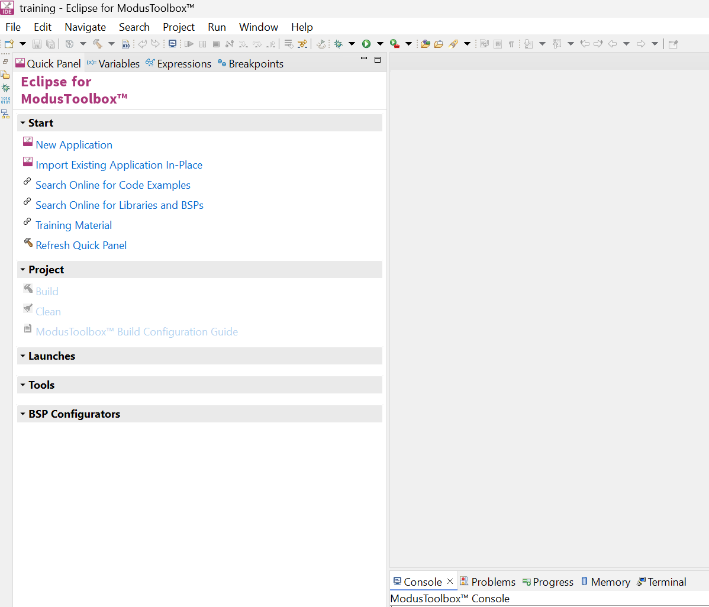

4. <span id="step-4-project-creation"></span> Select **New Application** from the Quick Panel or navigate to **File → New → ModusToolbox&trade; Application**. The **Project Creator Tool** opens.

5. Choose the **CY8CPROTO-041TP** Board Support Package (**BSP**) under the PSOC&trade; 4 BSPs, and then click **Next**.

    > **Note:** BSPs are aligned with our development/evaluation kits; they provide files for basic device functionality. A BSP typically has a **design.modus** file that configures clocks and other board-specific capabilities. That file is used by the ModusToolbox&trade; configurators. A BSP also includes the required device support code for the device on the board. You can modify the configuration to suit your application.

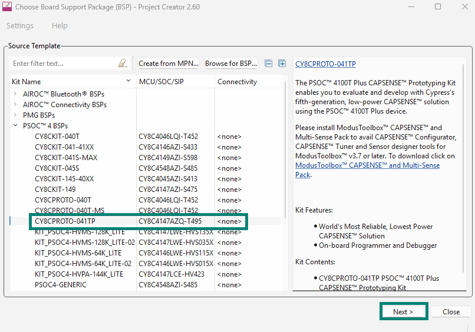

6. Click **Next** and continue to the next menu of the Project Creator.
7. Select the **Hello World** under the Getting Started section
    - Click the **checkbox** to the left of the application
    - Set the **New Application Name** to **safety\_test**
    - Click **Create**

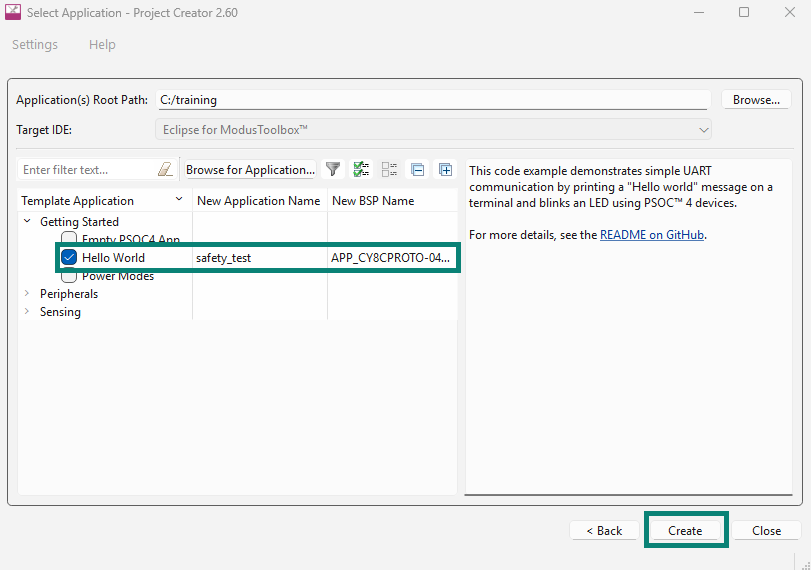

8. When you click **Create**, a new project is created, and you can see all the files in the Project Explorer window.

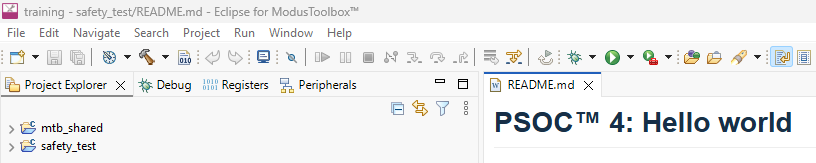

### Adding the Safety test library (STL)

1. Click the **safety\_test** project in the **Project Explorer**, and then open the library manager from the Eclipse IDE Quick Panel.

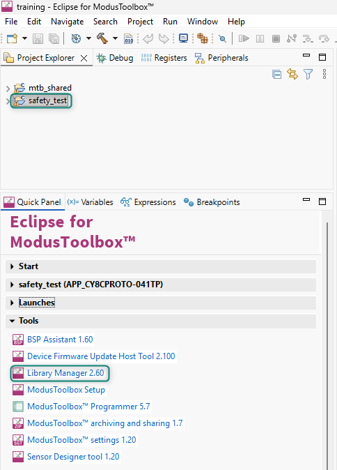

2. Click **Add Library**.

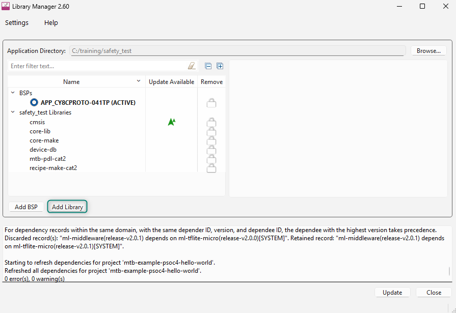

3. Search for **stl** in the **Enter filter text...** field, select the library from the results, and then press **OK**.

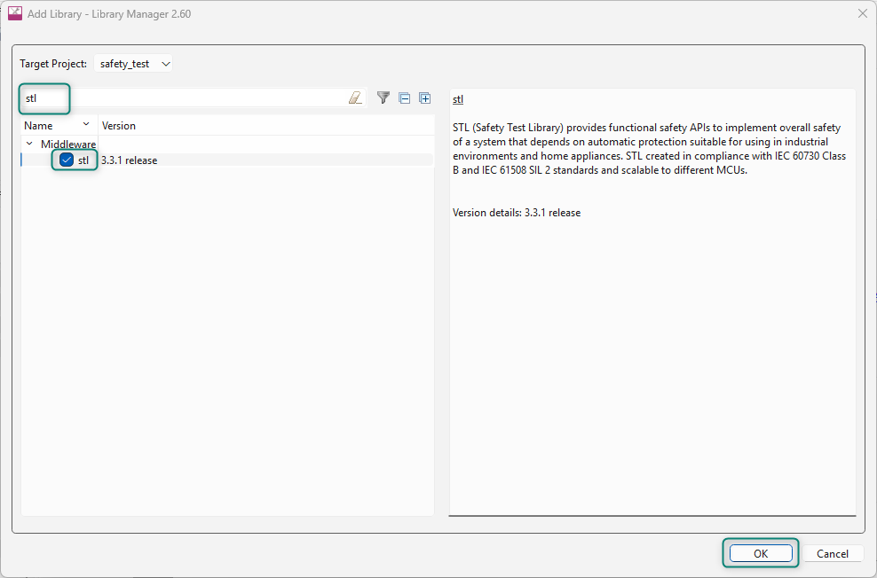

4. Press **Update** in the Library Manager and wait for the libraries to be updated. Close the Library Manager.

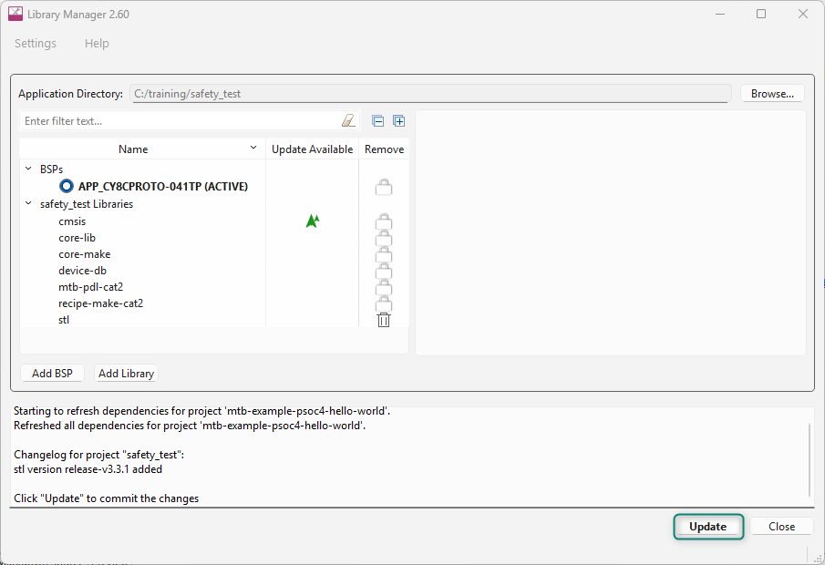

5. Once the Library Manager is closed, open the `main.c` file for the application.

6. Add the include for the CPU self tests. 

```c
#include "SelfTest_CPU.h"
```

7. Add the code below to the main function just before the infinite for loop begins.

```c
Cy_SCB_UART_PutString(CYBSP_UART_HW, "Self Test Program Counter\r\n");
if (0U == SelfTest_PC())
{
    Cy_SCB_UART_PutString(CYBSP_UART_HW, "Program Counter Test Passed\r\n");
}
else 
{
    Cy_SCB_UART_PutString(CYBSP_UART_HW, "Program Counter Test Failed\r\n");
}
```

### Programming and execution

1. Ensure that the evaluation kit is connected to the PC, and then program the device from the Eclipse IDE Quick Panel.

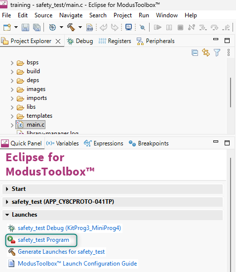

2. Open a terminal.

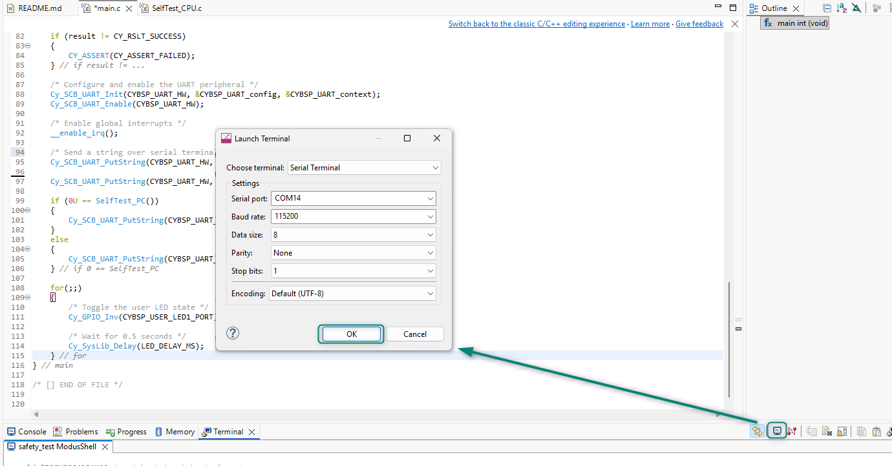

3. Observe the output.

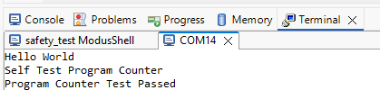

### Conclusion

In this exercise, you created the **Hello World** project and then added the safety test library to the project. Once the STL was added, you added the program counter safety test to confirm that the CPU PC is operating as expected before the application began blinking the LED every half second.

## Executing the core peripherals safety tests

In this lab, you will create the **Class-B Safety Test Core Peripherals** code example and then execute it.

### Running the Class-B safety test core peripherals project

1. From the Eclipse IDE Quick Panel, select **New Application**. In the BSP panel, select the **CY8CPROTO-041TP BSP**.
2. In the **Peripherals** drop-down, select the **Class-B Safety Test Core Peripherals** project, and then click **Create**.

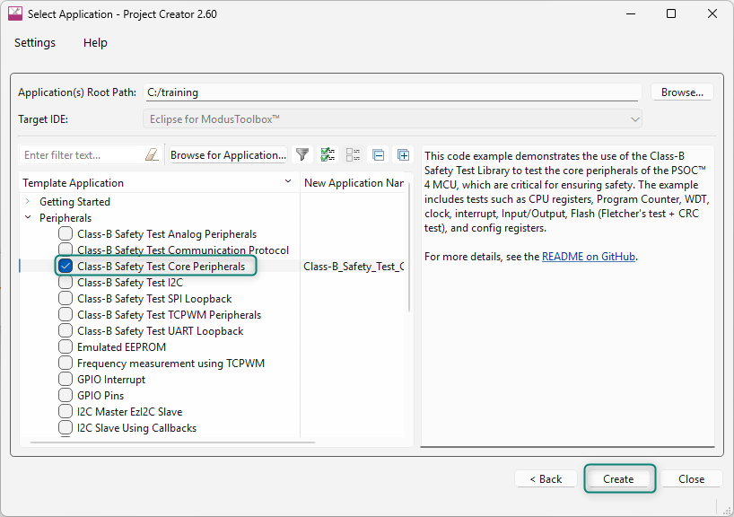

3. After the project is created, program the application from the Eclipse IDE Quick Panel.

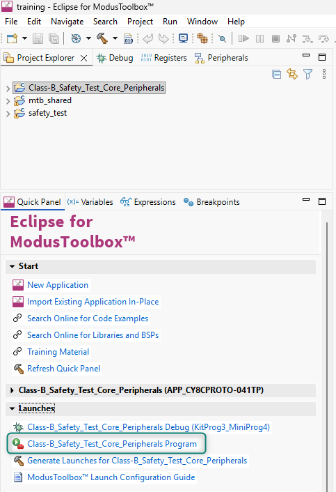

4. Open a terminal and observe the output of the core peripherals self tests.

    > **Note:** The flash test fails because the stored checksum has not been updated based on the application binary. The `Flash_Test` function calculates the checksum based on the entire flash region of the part, excluding the last 8 bytes that are reserved for checksum storage. Modify the stored checksum by setting the `flash_StoredCheckSum` variable in `self_test.c`. The test reports the calculated checksum, so you can copy this value from the output terminal. If a terminal cannot be used, run the project in a debug session to obtain the checksum value for the flash test. See AN89056, Appendix A for more instructions.

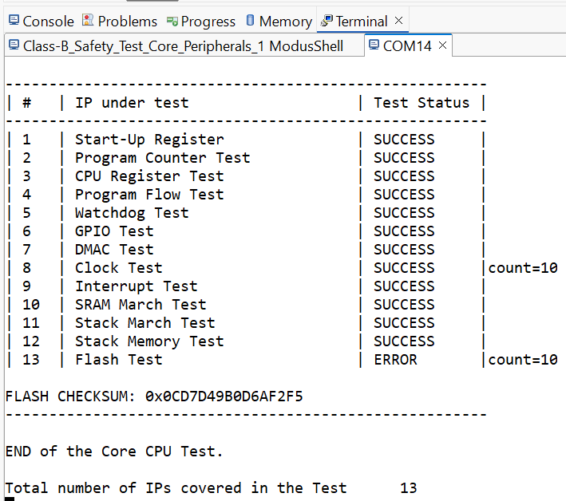

5. Copy the checksum from the terminal.
6. Replace the value set for the `flash_StoredCheckSum` variable in `self_test.c` for the **FLETCHER64** test mode.

```c
#if (FLASH_TEST_MODE == FLASH_TEST_FLETCHER64)
static volatile const uint64_t flash_StoredCheckSum __attribute__((used, section(".flash_checksum"))) = 0x0CD7D49B0D6AF2F5;
#endif
```

7. Reprogram the device and observe the terminal output.

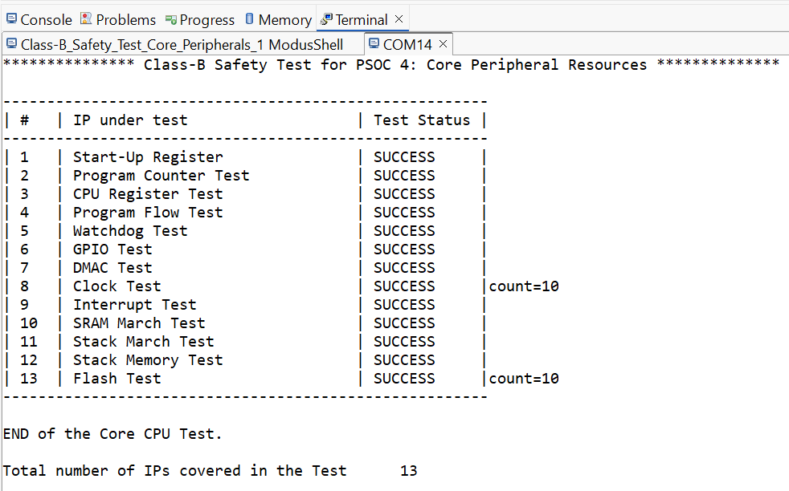

### Enabling runtime safety tests

In this section of the lab, you will create one function to run self-tests during initialization and another function to run self-tests during runtime. It may not be desirable to run some self-tests, such as the WDT test and the GPIO test, during runtime.

1. Open the `self_test.c` file and make the edits below to the `Clock_Test` function.

```c
/*****************************************************************************
* Function Name: Clock_Test
******************************************************************************
* Summary:
* Clock Test : Testing clock frequency using Independent Time slot
* monitoring technique
*
* Parameters:
*  initial_run: set to true if this is the first time executing this test.
*
* Return:
*  void
*****************************************************************************/
void Clock_Test(bool initial_run)
{
    if (INITIAL_TEST == initial_run)
    {
        /* Initialize WDT and Timer for Clock Self test */
        clock_test_init();
    }
    for (;;)
    {
        ret = SelfTest_Clock(CYBSP_CLOCK_TEST_TIMER_HW, CYBSP_CLOCK_TEST_TIMER_NUM);
        print_result(ip_index,"Clock Test", ret);
        if (PASS_STILL_TESTING_STATUS != ret) {
            break;
        }
        count++;
        if (count > MAX_INDEX_VAL){
            count = 0u;
        }
    }
    Cy_SysLib_ClearResetReason();
    /* Either you need to clear WDT interrupt periodically or
     * disable it to ensure no WDT reset */
    Cy_WDT_ClearInterrupt();
    Cy_WDT_Disable();
    ip_index++;
}
```

2. Make the edits below to the `Flash_Test` function.

```c
/*****************************************************************************
* Function Name: Flash_Test
******************************************************************************
* Summary:
* Flash Test : Testing the flash by comparing the stored checksum in
* flash with calculated checksum of the data stored in flash.
*
* Parameters:
*  initial_run: set to true if this is the first time executing this test. 
*
* Return:
*  void
*****************************************************************************/
void Flash_Test(bool initial_run)
{
    /* Variable for output calculated Flash Checksum */
    uint8_t flash_CheckSum_temp;
    char flash_CheckSum_act[32]={0};
    if (INITIAL_TEST == initial_run)
    {
#if defined (__ICCARM__)
        IAR_Flash_Init();
#else
        SelfTest_Flash_init(CY_FLASH_BASE,FLASH_END_ADDR,flash_StoredCheckSum);
#endif
    }
    for(;;)
    {
        ret = SelfTest_FlashCheckSum(FLASH_DOUBLE_WORDS_TO_TEST);
        print_result(ip_index, "Flash Test", ret);
        if (ERROR_STATUS == ret)
        {
#if(FLASH_TEST_MODE == FLASH_TEST_CRC32)
            Cy_SCB_UART_PutString(CYBSP_UART_HW,"\r\nFLASH CRC: 0x");
#elif (FLASH_TEST_MODE == FLASH_TEST_FLETCHER64)
            Cy_SCB_UART_PutString(CYBSP_UART_HW,"\r\nFLASH CHECKSUM: 0x");
#endif
            /* Output calculated Flash Checksum */
            for(int16_t i = sizeof(flash_CheckSum) - 1; i >= 0; i--)
            {
                flash_CheckSum_temp = (uint8_t) (flash_CheckSum >> (i*8u));
                sprintf(flash_CheckSum_act, "%02X", flash_CheckSum_temp);
                Cy_SCB_UART_PutString(CYBSP_UART_HW, flash_CheckSum_act);
            }
            Cy_SCB_UART_PutString(CYBSP_UART_HW,"\r\n");
            break;
        }
        else if (PASS_COMPLETE_STATUS == ret) {
            break;
        }
        else
        {
            /* Do Nothing */
        }
        count++;
        if (count > MAX_INDEX_VAL) {
            count = 0u;
        }
    }
    ip_index++;
}
	
```

3. Make the following edits to `Start_Up_Test`.

```c
/*****************************************************************************
* Function Name: Start_Up_Test
******************************************************************************
* Summary:
* Start Up Test : This function checks the startup configuration registers.
*
* Parameters:
*  initial_run: set to true if this is the first time executing this test. 
*
* Return:
*  void
*****************************************************************************/
void Start_Up_Test(bool initial_run)
{
	if (INITIAL_TEST == initial_run)
	{
#if COMPONENT_CAT1A
	    /* This function initilizes the AREF address depending on the device.*/
	    SelfTests_Init_StartUp_ConfigReg();
#endif
#if (STARTUP_CFG_REGS_MODE == CFG_REGS_TO_FLASH_MODE)
	    /*******************************/
	    /* Save Start-Up registers...  */
	    /*******************************/
	    if (CY_FLASH_DRV_SUCCESS  != SelfTests_Save_StartUp_ConfigReg())
	    {
	        /* Process error */
	        Cy_SCB_UART_PutString(CYBSP_UART_HW,"Error: Can't save Start-Up Config Registers\r\n");
	    }
#endif /* End (STARTUP_CFG_REGS_MODE == CFG_REGS_TO_FLASH_MODE) */
	}
    /**********************************/
    /* Run Start-Up regs Self Test... */
    /**********************************/
    ret = SelfTests_StartUp_ConfigReg();
    /* Process error */
    print_result(ip_index++,"Start-Up Register",ret);
}
```

4. Open the `self_test.h` file and make the edits below to the function definitions.

```c
#define INITIAL_TEST 		(true)
#define RUNTIME_TEST		(false)
/*******************************************************************************
* Function Prototypes
********************************************************************************/
void Clock_Test(bool initial_run);
void Flash_Test(bool initial_run);
void Interrupt_Test(void);
void IO_Test(void);
void SRAM_March_Test(void);
void Stack_March_Test(void);
void Stack_Memory_Test(void);
void Interrupt_test_Init(void);
void clock_test_init(void);
void Start_Up_Test(bool initial_run);
	
```

5. In the `main.c` file, add the following variable after the MACRO definitions.

```c
/*******************************************************************************
* Global Variables
*******************************************************************************/
uint32_t test_count = 0;
	
```

6. In the `main.c` file, add the following functions for running the self-tests at program init and runtime.

```c
static void print_self_test_header(void)
{
    /* \x1b[2J\x1b[;H - ANSI ESC sequence for clear screen */
    Cy_SCB_UART_PutString(CYBSP_UART_HW,"\x1b[2J\x1b[;H");
    Cy_SCB_UART_PutString(CYBSP_UART_HW,"*************** "
           "Class-B Safety Test for PSOC 4: Core Peripheral Resources "
           "************** \r\n\n");
    Cy_SCB_UART_PutString(CYBSP_UART_HW,"------------------------------------------------------- \r\n");
    Cy_SCB_UART_PutString(CYBSP_UART_HW,"| #   | IP under test                   | Test Status | \r\n");
    Cy_SCB_UART_PutString(CYBSP_UART_HW,"------------------------------------------------------- \r\n");
}
static void print_self_test_footer(void)
{
    char uart_disp_buff[64]={0};
    Cy_SCB_UART_PutString(CYBSP_UART_HW,"------------------------------------------------------- \r\n\n");
    Cy_SCB_UART_PutString(CYBSP_UART_HW,"END of the Core CPU Test.\r\n\n");
    sprintf(uart_disp_buff,"Total number of IPs covered in the Test      %d\r\n", --ip_index);
    Cy_SCB_UART_PutString(CYBSP_UART_HW, uart_disp_buff);
    sprintf(uart_disp_buff, "Test Count %d ", test_count);
    Cy_SCB_UART_PutString(CYBSP_UART_HW, uart_disp_buff);
}
static void run_initial_self_test(void)
{
    print_self_test_header();
    ip_index = 0;
    /* Start Up Test */
    Start_Up_Test(INITIAL_TEST);
    /* Program counter Test */
    ret = SelfTest_PC();
    print_result(ip_index++,"Program Counter Test",ret);
    /* CPU Registers Test*/
    ret = SelfTest_CPU_Registers();
    print_result(ip_index++,"CPU Register Test", ret);
    /* Program Flow Test*/
    ret = SelfTest_PROGRAM_FLOW();
    print_result(ip_index++,"Program Flow Test", ret);
    /* Watch Dog Timer Test */
    ret = SelfTest_WDT();
    print_result(ip_index++,"Watchdog Test", ret);
    /* GPIO Test */
    IO_Test();
    #if DMA_ENABLE
    /* DMAC Test */
    DMAC_Test();
    #endif
    /* Clock Test */
    Clock_Test(INITIAL_TEST);
    /* Interrupt Test */
    Interrupt_Test();
    /* SRAM Test */
    SRAM_March_Test();
    /* STACK Test */
    Stack_March_Test();
    /* Stack Overflow and Underflow Test */
    Stack_Memory_Test();
    /* Flash Test */
    Flash_Test(INITIAL_TEST);
    test_count++;
    print_self_test_footer();
	
}
static void run_runtime_self_tests(void)
{
    print_self_test_header();
    ip_index = 0;
    /* Start Up Test */
    Start_Up_Test(RUNTIME_TEST);
    /* Program counter Test */
    ret = SelfTest_PC();
    print_result(ip_index++,"Program Counter Test",ret);
    /* CPU Registers Test*/
    ret = SelfTest_CPU_Registers();
    print_result(ip_index++,"CPU Register Test", ret);
    /* Program Flow Test*/
    ret = SelfTest_PROGRAM_FLOW();
    print_result(ip_index++,"Program Flow Test", ret);
    /* GPIO Test */
    IO_Test();
    #if DMA_ENABLE
    /* DMAC Test */
    DMAC_Test();
    #endif
    /* Clock Test */
    Clock_Test(RUNTIME_TEST);
    /* Interrupt Test */
    Interrupt_Test();
    /* SRAM Test */
    SRAM_March_Test();
    /* STACK Test */
    Stack_March_Test();
    /* Stack Overflow and Underflow Test */
    Stack_Memory_Test();
    /* Flash Test */
    Flash_Test(RUNTIME_TEST);
    test_count++;
    print_self_test_footer();
}
	
```

7. In the `main.c` file, update the `main` function to execute the self-tests at init and during runtime.

```c
/* Enable global interrupts */
__enable_irq();
run_initial_self_test();

for (;;)
{
    run_runtime_self_tests();
    /* Delay emulates user code */
    Cy_SysLib_Delay(5000u);
}
```

8. Program the device and then follow the previous instructions for updating the flash checksum.

9. Once the checksum has been updated, all initial and runtime tests should pass.

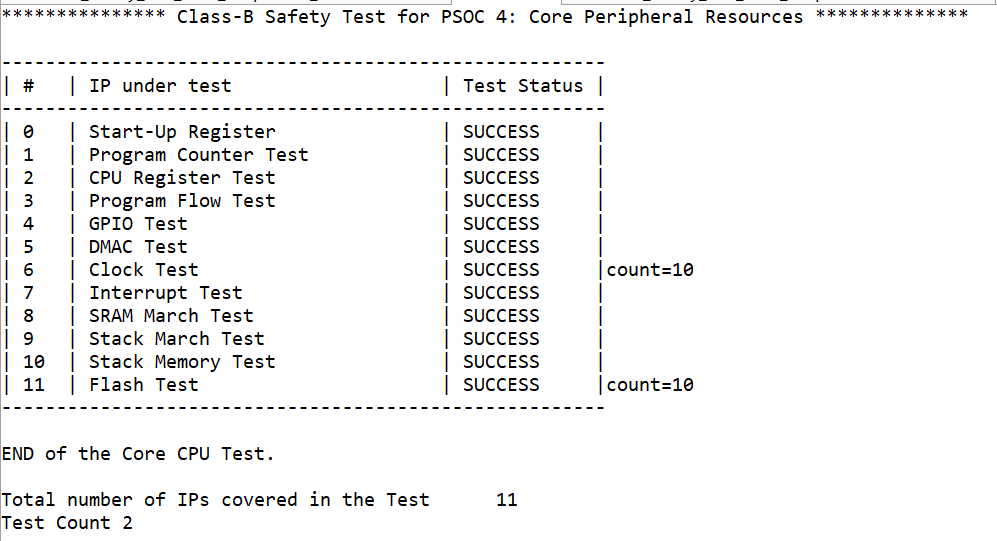

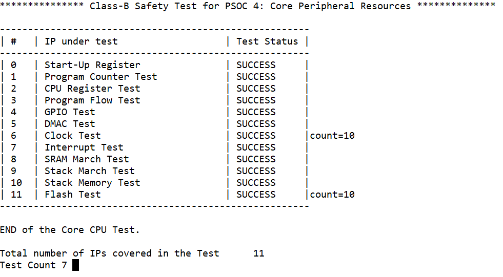

### Conclusion

The core peripherals safety tests provide a standard method for confirming that the device is operational during device initialization. These same safety tests can also be performed during runtime to ensure that the device is continuing to operate as expected. Some considerations should be made when executing safety tests during runtime. For example, the GPIO Test confirms that the GPIOs have not been shorted to ground or VCC by setting the GPIO high with an internal pull-up and reading back that the signal is high, and then setting the GPIO low with an internal pull-down and confirming that the signal is low. If the signal is an output, this would cause the output to change states. Other tests, such as the memory march tests, may also need to be considered.

## Executing the analog peripherals safety tests

### Running the Class-B\_Safety\_Test\_Analog\_Peripherals project

1. Using the same steps from the core peripherals lab, create the **Class-B\_Safety\_Test\_Analog\_Peripherals** code example.
2. Create a voltage divider circuit where R1 is a 150 kΩ resistor and R2 is a 75 kΩ resistor. Connect VDDA to the high side of the circuit and ground to the low side of the circuit. Connect P2.0 of the PSOC&trade; 4100T Plus kit to the center of the voltage divider. This causes the signal on P2.0 to go to VDD/3. The default configuration of the hardware sets VDD to 5 V, so the input to P2.0 should be 1.667 V.

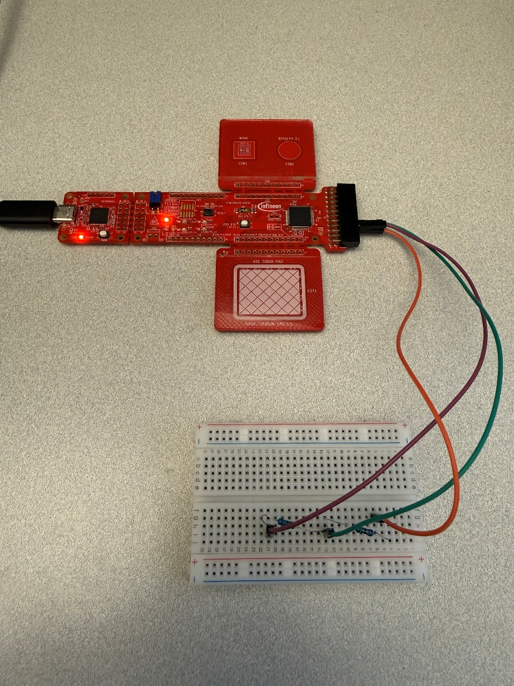

3. Program the project and observe the output.

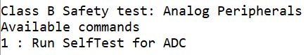

4. Enter `1` in the terminal and observe the status of the test.

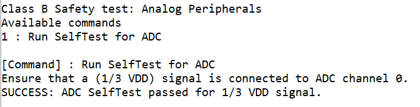

### Enabling measurement and test ADC channels

This ADC test utilizes an external voltage reference. This means that, to test the SAR ADC, a separate reference input from the desired measurement input is needed. In the code example project, the input to the SAR ADC is set to P2.0. Add code to measure the input of P2.1 periodically, and then switch to testing the SAR ADC on P2.0 when the user enters `1` in the terminal.

1. Open the device configurator and navigate to the **Peripherals** tab, and then click **PASS 0 12-bit SAR ADC 0**.
2. In the **Parameters** view, update the number of channels from 1 to 2, and then navigate to the **Channel 1** settings. Leave **Input Mode** set to **Single-ended**, and then select **P2[1] analog** as the **Ch1 Vplus** input.

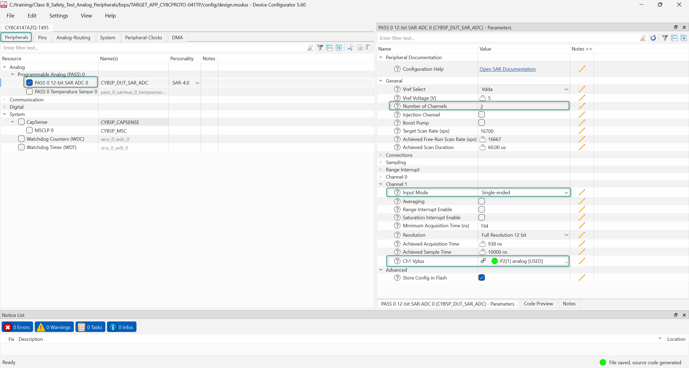

3. Save and close the device configurator.
4. Move the printout of available commands into its own function for repeated use.

```c
void print_available_commands(void)
{
	/* Display available commands */
    Cy_SCB_UART_PutString(CYBSP_UART_HW, "Available commands \r\n");
    #if ADC_ENABLE
    Cy_SCB_UART_PutString(CYBSP_UART_HW, "1 : Run SelfTest for ADC\r\n");
    #endif
    #if COMPARATOR_ENABLE
    Cy_SCB_UART_PutString(CYBSP_UART_HW, "2 : Run SelfTest for Comparator\r\n");
    #endif
    #if OPAMP_ENABLE
    Cy_SCB_UART_PutString(CYBSP_UART_HW, "3 : Run SelfTest for OP-AMP\r\n\n");
    #endif
}
```

5. Call the available commands function after enabling the SAR ADC and after executing the analog tests.
6. Create a SysTick callback function.

```c
volatile uint32_t systick_count = 0;
void SysTick_Callback(void)
{
	systick_count++;
}
```

7. Enable the SysTick timer to create a non-blocking periodic 1 ms timer after the `cybsp_init` function.

```c
Cy_SysTick_Init(CY_SYSTICK_CLOCK_SOURCE_CLK_CPU,((uint32_t)(((1000)/1000000.0)*48000000)));
/* Register one of the SysTick callbacks */
Cy_SysTick_SetCallback(0UL, &SysTick_Callback);
Cy_SysTick_Enable();
```

8. Create a function to run a one-shot ADC conversion.

```c
/** ADC conversion time, uS */
#define ADC_CON_TIME_uS             (1000u)
void scan_measure_channel(void)
{
    int16_t adc_res = 0;
    uint16_t guardCnt;
    /* Start ADC conversion */
    Cy_SAR_StartConvert(CYBSP_DUT_SAR_ADC_HW, CY_SAR_START_CONVERT_SINGLE_SHOT);
    /* Wait for the end of conversion using a guard interval > ADC conversion time */
    guardCnt = 0u;
    do
    {
        guardCnt++;
        Cy_SysLib_DelayUs(1u);
    } while((Cy_SAR_IsEndConversion(CYBSP_DUT_SAR_ADC_HW, CY_SAR_RETURN_STATUS) != CY_SAR_SUCCESS) && (guardCnt < ADC_TEST_CON_TIME_uS));
    /* Check if timeout */
    if (guardCnt < ADC_CON_TIME_uS)
    {
		char adc_string[100]; 
        /* Read the value from ADC */
        adc_res = Cy_SAR_GetResult16(CYBSP_DUT_SAR_ADC_HW, ADC_MEASUREMENT_CHANNEL);
        adc_res = Cy_SAR_CountsTo_mVolts(CYBSP_DUT_SAR_ADC_HW, ADC_MEASUREMENT_CHANNEL, adc_res);
		sprintf(adc_string, "ADC Channel %d Result: %hd mV\r\n", ADC_MEASUREMENT_CHANNEL, adc_res);
		Cy_SCB_UART_PutString(CYBSP_UART_HW, adc_string);
    }
}
```

9. Add MACROs to the main.c file to define the test channel and measurement channel indexes and masks.

```c
#define ADC_TEST_CHANNEL					(0U)
#define ADC_MEASUREMENT_CHANNEL				(1U)
#define ADC_TEST_CHANNEL_MASK				(1<<ADC_TEST_CHANNEL)
#define ADC_MEASUREMENT_CHANNEL_MASK		(1<<ADC_MEASUREMENT_CHANNEL)
```

10. Disable all ADC channels after enabling the ADC.

```c
#if ADC_ENABLE
/* Initialize ADC as per config structure and enable ADC */
sar_res = Cy_SAR_Init(CYBSP_DUT_SAR_ADC_HW, &CYBSP_DUT_SAR_ADC_config);
if (sar_res != CY_SAR_SUCCESS)
{
    CY_ASSERT(0);
}   
Cy_SAR_Enable(CYBSP_DUT_SAR_ADC_HW);
#endif
Cy_SAR_DisableChannels(CYBSP_DUT_SAR_ADC_HW, ADC_TEST_CHANNEL_MASK | ADC_MEASUREMENT_CHANNEL_MASK);
```

11. Enable the test ADC channel before executing the ADC self-test, and then disable all ADC channels after the test.

```c
if (SELFTEST_CMD_ADC == result)
{
    valid_command++;
    Cy_SCB_UART_PutString(CYBSP_UART_HW, "\r\n[Command] : Run SelfTest for ADC\r\n");
    Cy_SAR_EnableChannels(CYBSP_DUT_SAR_ADC_HW, ADC_TEST_CHANNEL_MASK);
    adc_test();
    Cy_SAR_DisableChannels(CYBSP_DUT_SAR_ADC_HW, ADC_TEST_CHANNEL_MASK | 
                                                 ADC_MEASUREMENT_CHANNEL_MASK);
}
```

12. Add a MACRO to define the SysTick count to check before running the ADC for the measurement channel.

```c
#define ONE_SECOND_TICK				(1000u)
```

13. Enable the measurement ADC channel before using the measurement ADC channel, and then disable all ADC channels.

```c
for(;;)
{
    if (ONE_SECOND_TICK < systick_count)
    {
        systick_count = 0;
        Cy_SAR_EnableChannels(CYBSP_DUT_SAR_ADC_HW, ADC_MEASUREMENT_CHANNEL_MASK);
        scan_measure_channel();
        Cy_SAR_DisableChannels(CYBSP_DUT_SAR_ADC_HW, ADC_TEST_CHANNEL_MASK | 
        ADC_MEASUREMENT_CHANNEL_MASK);
    }
```

14. Program the device and observe the output.

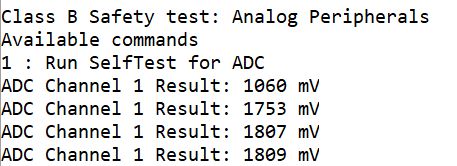

15. Enter `1` in the terminal and observe the passing test.

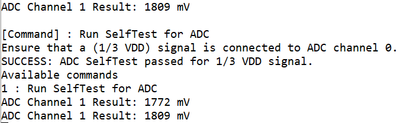

### Conclusion

The analog peripherals safety tests provide a standard method for confirming that the peripherals are operating as expected. With the proper design, the analog peripherals can be tested during initialization and during runtime to ensure that the device is operational. The ADC test implements an independent input comparison as defined in Section H.2.18.8 of the IEC 60730 standard. Other PSOC&trade; 4 devices can generate an internal reference voltage to eliminate the need for an external reference for safety tests.

## Executing the communication block safety test

### Running the Class-B\_Safety\_Test\_UART\_Loopback project

1. Using the same steps from the core peripherals lab, create the **Class-B\_Safety\_Test\_UART\_Loopback** code example.
2. Program the project and observe the output.

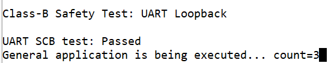

### Controlling UART GPIOs to send data when not running self test

1. Open the device configurator and navigate to the **Pins** tab and expand **Port 2**.

2. Name **P2.0** **UART_RX** and name **P2.1** **UART_TX**. 

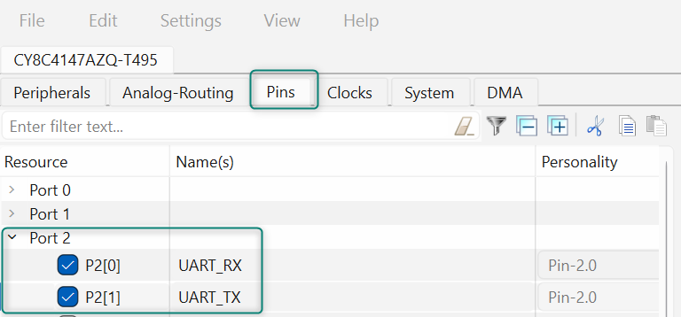

3. Save and close the device configurator.

4. Add custom UART RX and UART TX pin configuration structures to configure the pins for UART use.

```c
/*******************************************************************************
* Global Variables
*******************************************************************************/
const cy_stc_gpio_pin_config_t uart_rx_pin_config =
{
    .outVal = 1,
    .driveMode = CY_GPIO_DM_HIGHZ,
    .hsiom = P2_0_SCB2_UART_RX,
    .intEdge = CY_GPIO_INTR_DISABLE,
    .vtrip = CY_GPIO_VTRIP_CMOS,
    .slewRate = CY_GPIO_SLEW_FAST,
};
const cy_stc_gpio_pin_config_t uart_tx_pin_config =
{
    .outVal = 1,
    .driveMode = CY_GPIO_DM_STRONG_IN_OFF,
    .hsiom = P2_1_SCB2_UART_TX,
    .intEdge = CY_GPIO_INTR_DISABLE,
    .vtrip = CY_GPIO_VTRIP_CMOS,
    .slewRate = CY_GPIO_SLEW_FAST,
};
```

5. Add user code to switch and reconfigure the GPIOs before and after calling **Execute\_Application** to direct the UART signals to the GPIOs for application use or for self-test use.

```c
case EXE_CUSTOM_APP:
    /* Configure pins for UART operation. */
    Cy_GPIO_Pin_Init(UART_RX_PORT, UART_RX_PIN, &uart_rx_pin_config);
    Cy_GPIO_Pin_Init(UART_TX_PORT, UART_TX_PIN, &uart_tx_pin_config);
    /*A function to mimic application to be executed after UART selftest have passed.*/
    Execute_Application();
    /* Configure pins for SMART-IO Loop-back. */
    Cy_GPIO_Pin_Init(UART_RX_PORT, UART_RX_PIN, &UART_RX_config);
    Cy_GPIO_Pin_Init(UART_TX_PORT, UART_TX_PIN, &UART_TX_config);
    break;
```

6. Update **Execute\_Application** to print a message to prove that the UART signals are being redirected to the GPIOs.

```c
static void Execute_Application(void)
{
    static uint16_t count = 0u;
    char message[100];
    static uint32_t message_index = 0; 
#if DEBUG_LOG_ENABLE
    /* Print test counter */
    sprintf(uart_print_buff, "\rGeneral application is being executed... count=%d", count);
    Cy_SCB_UART_PutString(CYBSP_UART_HW, uart_print_buff);
#endif
	
    sprintf(message, "Message %d \r\n", message_index);
    Cy_SCB_UART_PutString(CYBSP_DUT_UART_HW, message);
    message_index++;
```

7. Connect the UART signals from the kit to a MiniProg4 (CY8CKIT-005-A).

    Use the following connections:

    | MiniProg4 UART signal | Kit pin |
    | --- | --- |
    | UART TX | P2.0 (PSOC&trade; 4100T Plus UART RX) |
    | UART RX | P2.1 (PSOC&trade; 4100T Plus UART TX) |


8. Program the device and observe the debug UART terminal and the UART under-test terminal.


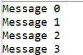

### Conclusion

This test implements the UART data loopback test. The test is successful if the transmitted byte is equal to the received byte and returns 2. Each function call increments the byte sent. After 256 function calls, if all bytes are received correctly, the function returns 3. In this lab, the GPIOs associated with the UART under test were configured to direct the UART signal to them once the test passed. The GPIOs were then configured so that the UART signals were directed to SMART-IO before executing the UART test.

## References

1. AN236847: PSOC&trade; 4 IEC 60730 Class B and IEC 61508 SIL safety software library for ModusToolbox&trade;; [Available online](https://www.infineon.com/assets/row/public/documents/30/42/infineon-an236847---psoc-tm-4-iec-60730-class-b-and-iec-61508-sil-safety-software-library-for-modustoolbox-tm-applicationnotes-en.pdf?fileId=8ac78c8c8b6555fe018bb0c7af2d027f)


## Revision history

| Document revision | Date | Description of changes |
| --- | --- | --- |
| \*\* | 2026-07-24 | Initial release |

### Disclaimer
All referenced product or service names and trademarks are the property of their respective owners.

The Bluetooth&reg; word mark and logos are registered trademarks owned by Bluetooth SIG, Inc., and any use of such marks by Infineon is under license.

PSOC&trade;, formerly known as PSoC&trade;, is a trademark of Infineon Technologies. Any references to PSoC&trade; in this document or others shall be deemed to refer to PSOC&trade;.

---------------------------------------------------------

© Cypress Semiconductor Corporation, 2023-2026. This document is the property of Cypress Semiconductor Corporation, an Infineon Technologies company, and its affiliates ("Cypress").  This document, including any software or firmware included or referenced in this document ("Software"), is owned by Cypress under the intellectual property laws and treaties of the United States and other countries worldwide.  Cypress reserves all rights under such laws and treaties and does not, except as specifically stated in this paragraph, grant any license under its patents, copyrights, trademarks, or other intellectual property rights.  If the Software is not accompanied by a license agreement and you do not otherwise have a written agreement with Cypress governing the use of the Software, then Cypress hereby grants you a personal, non-exclusive, nontransferable license (without the right to sublicense) (1) under its copyright rights in the Software (a) for Software provided in source code form, to modify and reproduce the Software solely for use with Cypress hardware products, only internally within your organization, and (b) to distribute the Software in binary code form externally to end users (either directly or indirectly through resellers and distributors), solely for use on Cypress hardware product units, and (2) under those claims of Cypress's patents that are infringed by the Software (as provided by Cypress, unmodified) to make, use, distribute, and import the Software solely for use with Cypress hardware products.  Any other use, reproduction, modification, translation, or compilation of the Software is prohibited.
<br>
TO THE EXTENT PERMITTED BY APPLICABLE LAW, CYPRESS MAKES NO WARRANTY OF ANY KIND, EXPRESS OR IMPLIED, WITH REGARD TO THIS DOCUMENT OR ANY SOFTWARE OR ACCOMPANYING HARDWARE, INCLUDING, BUT NOT LIMITED TO, THE IMPLIED WARRANTIES OF MERCHANTABILITY AND FITNESS FOR A PARTICULAR PURPOSE.  No computing device can be absolutely secure.  Therefore, despite security measures implemented in Cypress hardware or software products, Cypress shall have no liability arising out of any security breach, such as unauthorized access to or use of a Cypress product. CYPRESS DOES NOT REPRESENT, WARRANT, OR GUARANTEE THAT CYPRESS PRODUCTS, OR SYSTEMS CREATED USING CYPRESS PRODUCTS, WILL BE FREE FROM CORRUPTION, ATTACK, VIRUSES, INTERFERENCE, HACKING, DATA LOSS OR THEFT, OR OTHER SECURITY INTRUSION (collectively, "Security Breach").  Cypress disclaims any liability relating to any Security Breach, and you shall and hereby do release Cypress from any claim, damage, or other liability arising from any Security Breach.  In addition, the products described in these materials may contain design defects or errors known as errata which may cause the product to deviate from published specifications. To the extent permitted by applicable law, Cypress reserves the right to make changes to this document without further notice. Cypress does not assume any liability arising out of the application or use of any product or circuit described in this document. Any information provided in this document, including any sample design information or programming code, is provided only for reference purposes.  It is the responsibility of the user of this document to properly design, program, and test the functionality and safety of any application made of this information and any resulting product.  "High-Risk Device" means any device or system whose failure could cause personal injury, death, or property damage.  Examples of High-Risk Devices are weapons, nuclear installations, surgical implants, and other medical devices.  "Critical Component" means any component of a High-Risk Device whose failure to perform can be reasonably expected to cause, directly or indirectly, the failure of the High-Risk Device, or to affect its safety or effectiveness.  Cypress is not liable, in whole or in part, and you shall and hereby do release Cypress from any claim, damage, or other liability arising from any use of a Cypress product as a Critical Component in a High-Risk Device. You shall indemnify and hold Cypress, including its affiliates, and its directors, officers, employees, agents, distributors, and assigns harmless from and against all claims, costs, damages, and expenses, arising out of any claim, including claims for product liability, personal injury or death, or property damage arising from any use of a Cypress product as a Critical Component in a High-Risk Device. Cypress products are not intended or authorized for use as a Critical Component in any High-Risk Device except to the limited extent that (i) Cypress's published data sheet for the product explicitly states Cypress has qualified the product for use in a specific High-Risk Device, or (ii) Cypress has given you advance written authorization to use the product as a Critical Component in the specific High-Risk Device and you have signed a separate indemnification agreement.
<br>
Cypress, the Cypress logo, and combinations thereof, ModusToolbox, PSoC, CAPSENSE, EZ-USB, F-RAM, and TRAVEO are trademarks or registered trademarks of Cypress or a subsidiary of Cypress in the United States or in other countries. For a more complete list of Cypress trademarks, visit www.infineon.com. Other names and brands may be claimed as property of their respective owners.